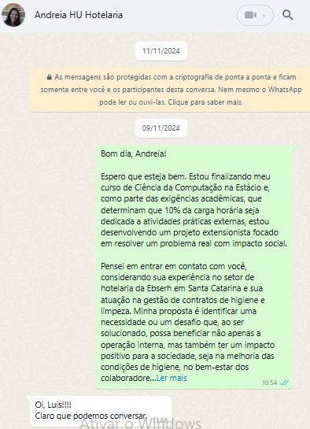
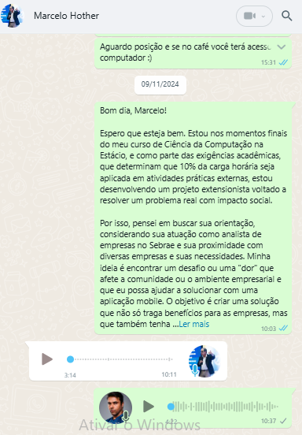
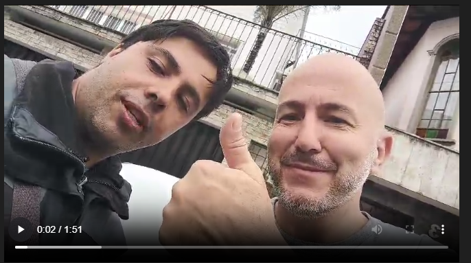
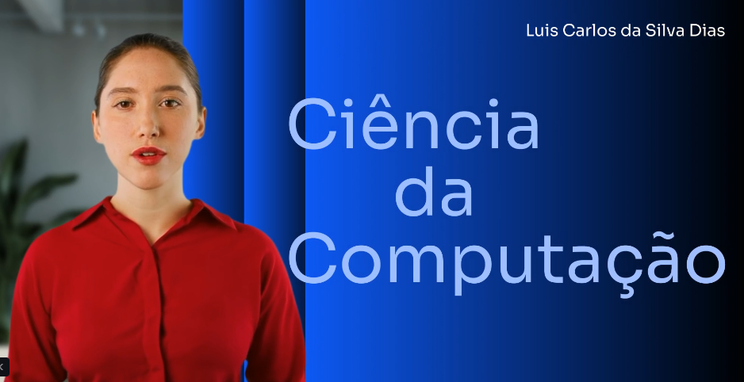
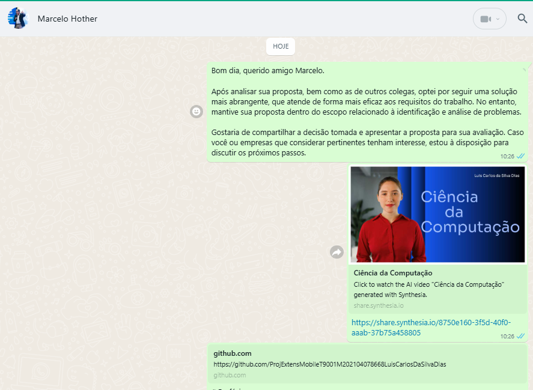
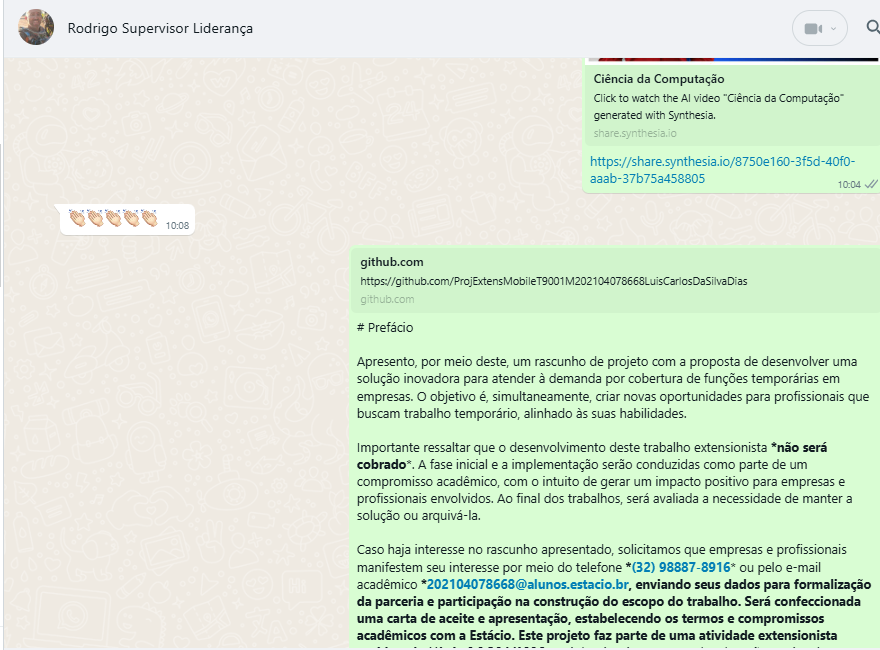

# 3.2 - Evidências das atividades realizadas - Histórico de Desenvolvimento da Aplicação

## Levantamento Histórico de Atos - Trabalho de Extensão

**Data de Criação do Histórico**: 09/11/2024, às 21:50  
**Aluno**: Luis Carlos da Silva Dias  
**Instituição de Ensino**: Estácio - Polo Centro Juiz de Fora  
**Matrícula**: 202104078668  
**Turma**: 9001  
**E-mail**: silvadias.perfil@outlook.com  
**E-mail Acadêmico**: 202104078668@alunos.estacio.br  
**Contato**: (32) 98887-8916  
**Curso**: Ciência da Computação, 8º e último período  
**Disciplina**: Programação Para Dispositivos Móveis em Android  
**Repositório GitHub**: [ProjExtensMobileT9001M202104078668LuisCarlosDaSilvaDias](https://github.com/silvadias/ProjExtensMobileT9001M202104078668LuisCarlosDaSilvaDias/commit/934d167ee8fbdb94e12ec2fb22a10c1bfe399896)  
**Data de Criação do Repositório**: 09/11/2024, às 20:49  

---

Este documento será utilizado como histórico contínuo de desenvolvimento da aplicação, conforme a seção **3.2 - Evidência das Atividades Realizadas**. Ele funcionará como **ata de evolução** e **comprovante das atividades** executadas durante o processo de criação do aplicativo, seguindo as orientações da disciplina.

---

## Objetivo e Contextualização

De acordo com as diretrizes da disciplina, o desenvolvimento será acompanhado de **evidências contínuas**, como:  
- Fotografias  
- Capturas de tela  
- Vídeos  
- Cartas de autorização assinadas pelos participantes da comunidade local  
- Cartas de apresentação  

Essas evidências comprovarão a realização das atividades e poderão ser utilizadas para **exposição acadêmica** em mostras e seminários de extensão da instituição.

---

## Formato de Registro de Evidências

Cada evidência será documentada de forma detalhada, seguindo o padrão abaixo:

1. **Descrição da Evidência**: Explicação detalhada do que está sendo fornecido (fotos, vídeos ou outros documentos).  
2. **Contextualização**: Explicação do momento em que a evidência foi gerada, sua relevância para a atividade extensionista e o que está sendo demonstrado.  
3. **Informações Específicas**: Registro da data, local e demais detalhes que identifiquem e contextualizem a evidência.

---

## Primeiras Evidências - Relatado 15/11/2024. - Contatos

### Contato com Andreia Carneiro

As primeiras ações documentadas no trabalho de extensão incluíram o envio de mensagens via WhatsApp para potenciais parceiros. Entre os contatos iniciais, destacamos **Andreia Carneiro**, enfermeira concursada pela Ebserh, com atuação em liderança no setor de hotelaria e gestão de contratos de higienização.

Andreia demonstrou grande receptividade à proposta da Estácio, mostrando-se aberta ao diálogo. A interação inicial estabelecida dia 09/11/2024 está registrada no seguinte print de WhatsApp:  

  
print:(/evidencias/media/prints/andreiaCarneiroContato-001-watsapp.png) 

**Perfil no LinkedIn**: [Andreia Carneiro](https://www.linkedin.com/in/andreia-carneiro-48ab33196/)  
https://www.linkedin.com/in/andreia-carneiro-48ab33196 

---

### Contato com Marcelo Rother  

Outro parceiro importante foi **Marcelo Rother**, Sócio-Diretor da **Rother e Associados Consultoria e Treinamento** e professor de Pós-Graduação na PUC MG. Marcelo possui vasta experiência como consultor e já atuou como analista do SEBRAE, sendo conhecido por sua postura aberta e empática.

Marcelo respondeu prontamente ao contato realizado no dia **09/01/2024, às 10:03h**, enviando uma demanda de relevância estratégica para uma empresa da região às **10:11h** do mesmo dia.  

Print e áudio registrados:  

   
print: /evidencias/media/prints/marceloRotherContato-001-watsapp.png  
🎙️ **Áudio de Marcelo Rother**: [Clique para ouvir](../../evidencias/media/audios/marceloHotherRespotaDoPrimeiroContato.mp3)  
Audio: /evidencias/media/audios/marceloHotherRespotaDoPrimeiroContato.mp3   

**Perfil no LinkedIn**: [Marcelo Rother](https://www.linkedin.com/in/marcelo-rother-a6a9b024/)  
https://www.linkedin.com/in/marcelo-rother-a6a9b024 

---

### Encontro com Rodrigo Carvalho  

No dia **18/12/2024**, tive a oportunidade de reencontrar **Rodrigo Carvalho**, Supervisor Operacional da empresa **Liderança Serviços**. Rodrigo reside em Matias Barbosa, cidade vizinha, e gerencia contratos em Juiz de Fora e região, com base na filial localizada na **Travessa Doutor Prisco, Nº 20 – Sala 401, Centro, Juiz de Fora/MG, CEP 36010-330, telefone (32) 3026-1815**.  

O encontro aconteceu de forma espontânea, durante meu trajeto para casa, quando identifiquei o carro da empresa estacionado. Aproveitei para iniciar uma conversa com Rodrigo, com quem já trabalhei anteriormente enquanto atuava como Encarregado na **Ebserh**, sob sua supervisão como gestor de contratos.  

Durante a conversa, Rodrigo demonstrou interesse no trabalho de extensão e contribuiu com ideias iniciais que poderão ser analisadas nas próximas etapas do projeto. Este momento marcou o fortalecimento da rede de contatos e a identificação de possibilidades relevantes para atender às demandas identificadas.  

**Vídeo do Encontro com Rodrigo**:   
  
Imagem: (/evidencias/media/imagens/rodridoEncontro001.png)  
Video: (/evidencias/media/videos/rodrigoCarvalhoEncontro-18122024.mp4)

Rodrigo Carvalho está disponível pelo telefone corporativo **+55 (48) 98812-2137** e e-mail **rodrigo.carvalho@lideranca.com.br**. Ele integra a equipe da **Liderança Serviços**, uma empresa catarinense fundada em janeiro de 1995, especializada na terceirização de serviços de limpeza e apoio administrativo.

---

# Escolha da Demanda para o Projeto

Na primeira etapa do trabalho de extensão, que consistiu em entrar em contato com a comunidade para identificar demandas, surgiram diversas propostas com temáticas variadas. Entre elas, destacaram-se:

- **Cuidados com pets**: A ideia de criar uma plataforma que ajudasse as pessoas a treinar seus animais de estimação por meio de uma aplicação.
- **Campo religioso**: A proposta de desenvolver um aplicativo para facilitar o pagamento de dízimos e ofertas, garantindo o anonimato dos doadores que quisessem preservar sua identidade.
- **Serviços de manicure**: A criação de uma plataforma específica para gerenciar e catalogar serviços de manicure, atendendo às demandas de microempreendedores individuais (MEIs) e explorando um nicho ainda pouco explorado.
- **Coleta de lixo hospitalar**: Uma aplicação para facilitar o registro e controle da coleta de lixo hospitalar, com foco na gestão ambiental e hospitalar de insumos.
- **Quiz de treinamento profissional**: Desenvolvimento de uma aplicação que utiliza quizzes interativos para auxiliar profissionais no aprimoramento de suas habilidades técnicas e comportamentais. A plataforma poderia incluir módulos personalizados por área de atuação, feedback imediato para respostas e relatórios de desempenho para acompanhamento do progresso.  

Embora todas as ideias tenham sido interessantes, decidi não aprofundar em nenhuma delas, pois exigiriam um tema mais específico, um prazo definido e a presença contínua de pessoas para levantamento de dados e execução das tarefas. Além disso, o grau de complexidade de alguns projetos e o impacto limitado para empresas ou públicos restritos me levaram a buscar uma alternativa que atendesse melhor aos requisitos da extensão.

Com base nesses critérios, destaco a proposta que surgiu a partir do contato com Rodrigo Carvalho, da empresa Liderança, com quem trabalhei anteriormente. Durante nossa conversa, identifiquei uma demanda relevante que se alinha ao propósito do trabalho de extensão e contempla os seguintes pontos:

## Eixos de Extensão e Pesquisa

O projeto, conforme evidenciado pela proposta, está vinculado aos seguintes eixos da extensão e pesquisa:

- **Científico-Acadêmico**: A atividade extensionista se insere no âmbito acadêmico, com objetivos de promover aprendizado e inovação.
- **Empregabilidade**: Criação de redes de contato e oportunidades de trabalho.
- **Empreendedorismo e Inovação**: Desenvolvimento de soluções criativas e aplicáveis ao mercado.
- **Sustentabilidade**: Propostas que gerem impacto social e ambiental positivo.

## Público Envolvido

O projeto envolve os seguintes públicos:

- Instituições públicas e privadas (empresas, escolas, associações, entidades governamentais, etc.);
- Microempreendedores individuais;
- Membros da comunidade local, situados no entorno da instituição.

Com base nas evidências das propostas não selecionadas, agora apresento a proposta vencedora que incorpora os eixos de extensão e pesquisa e o público envolvido mencionado acima.

## Problema Identificado para inicio da atividade extensionista

O problema identificado diz respeito a empresas que operam em autarquias, fundações, tanto públicas quanto privadas, que enfrentam dificuldades quando há a ausência de um funcionário do quadro fixo. Nesse caso, elas precisam rapidamente contratar alguém para fazer a cobertura, sob pena de penalização financeira. Algumas empresas optam por contratar funcionários extras, mas isso se torna caro, especialmente quando esses funcionários ficam ociosos. Além disso, as empresas frequentemente precisam fazer chamadas informais para verificar a disponibilidade de profissionais para cobrir vagas temporárias. Muitas vezes, essas interações ocorrem por meio de canais básicos, como grupos de conversa, que não oferecem uma organização adequada. Esses canais não permitem o registro ou a classificação do tempo de disponibilidade dos profissionais, nem o mapeamento do seu interesse, tornando o processo ineficiente e dificultando a gestão dessas oportunidades temporárias.

## Oportunidade de Solução

A oportunidade é criar uma aplicação que integre a sociedade ociosa, promovendo a sustentabilidade nas empresas. A ideia é economizar recursos, criando uma ponte de cooperação entre empresas que precisam de serviços temporários e pessoas que estão fora do mercado de trabalho, mas que podem ser contratadas para essas funções avulsas. Ao mesmo tempo, isso permitirá que as empresas tenham funcionários em prontidão e cumpram o contrato sem ser penalizada, além de possibilitar que essas pessoas, ao assumirem essas funções temporárias, construam confiança para futuras contratações para o quadro fixo.

---

# Marco 1 - 18/12/2024

## Fim da busca por demandas gerais e foco na pesquisa de um problema específico

A partir deste marco, a busca por demandas será focada exclusivamente na cobertura temporária de funcionários de empresas, conectando profissionais qualificados e disponíveis para essas funções temporárias.   

---

# Próximos Passos  

---  

## Objetivo do Trabalho Extensionista

Desenvolver um aplicativo chamado CobreAqui, que conecta empresas que necessitam de cobertura temporária para funcionários do quadro fixo com profissionais disponíveis para realizar trabalhos temporários. O objetivo é melhorar os relatórios de contratação, a disponibilidade de serviço e fomentar a colaboração entre empresas com a mesma problemática, além de criar oportunidades para profissionais que buscam trabalhos temporários.

---  
## Estrutura de Ações  

### 1. Mobilizar e Identificar Necessidades  

1.1 **Criar o rascunho do projeto**: Formalizar a ideia inicial que transmita aos envolvidos o impacto da solução na sociedade.  
1.2 **Mobilizar empresas com demanda similar**: Identificar e envolver empresas que enfrentam dificuldades com a cobertura temporária de funcionários.  
1.3 **Mobilizar profissionais ociosos**: Conectar e engajar profissionais que desejam atuar em trabalhos temporários.  

### 2. Coleta e Organização de Dados Iniciais  

2.1 **Registrar conceitos, expectativas e brainstorms**: Coletar ideias e expectativas dos stakeholders diretamente ligados ao problema.  
2.2 **Mapear o problema**: Analisar o cenário atual de empresas e profissionais envolvidos para identificar as principais dificuldades enfrentadas.  

### 3. Levantamento e Formalização de Requisitos  

3.1 **Levantar os requisitos**: Definir os requisitos funcionais e técnicos necessários para a solução, incluindo:  

- Cadastro de empresas e tipos de profissionais necessários.  
- Cadastro de profissionais e suas áreas de atuação.  
- Sistema de notificação para vagas e aceitação de serviços.  
  
3.2 **Formalizar os stakeholders**: Criação do TAP oficial, Identificar e documentar todas as partes interessadas no projeto.  

### 4. Planejamento e Validação da Solução  

4.1 **Modelar a solução**: Criar modelos de casos de uso, wireframes e diagramas representativos para o aplicativo.  
4.2 **Validar a solução**: Realizar testes iniciais e validar hipóteses com os stakeholders através de feedback iterativo através do uso do BDD.  

### 5. Desenvolvimento e Implementação  

5.1 **Desenvolver o aplicativo**: Criar a aplicação utilizando tecnologia adequada, incorporando os requisitos definidos.  
5.2 **Integrar ferramentas de teste**: Configurar automação de testes unitários e de integração para o software.  

### 6. Testes e Ajustes  

6.1 **Testar o aplicativo com dados reais**: Realizar testes funcionais, de usabilidade e de performance utilizando dados fornecidos pelas empresas e profissionais cadastrados.  
6.2 **Ajustar funcionalidades**: Incorporar ajustes e melhorias conforme feedback dos stakeholders.  

### 7. Treinamento e Avaliação  

7.1 **Treinar os colaboradores**: Realizar reunião de treinamento para capacitar empresas e profissionais no uso do sistema.  
7.2 **Realizar pesquisa de satisfação**: Coletar feedback de empresas e profissionais para mensurar o atingimento do objetivo da atividade extensionista.  

---

## Observações Adicionais

- Incorporar metodologias ágeis, como BDD (Behavior-Driven Development), para alavancar a colaboração entre stakeholders e equipes técnicas.  
- Documentar o processo detalhadamente para gerar relatórios consistentes, servindo como material de referência para outros trabalhos extensionistas.  
- Estabelecer prazos claros e mensuráveis para cada etapa no cronograma definitivo.  
- Promover um ambiente colaborativo que facilite a adaptação e a iteratividade durante todas as fases do projeto.  

Esse esboço sintetiza os elementos necessários para garantir a clareza e execução eficiente do trabalho extensionista, permitindo o desenvolvimento completo do aplicativo com impacto positivo para os envolvidos.  

---

# Início do Marco 2  

## Esboço do Projeto para Mobilização de Empresas e Profissionais  

### Rascunho do Projeto Criado em 19/12/2024  
Foi elaborado um rascunho para apresentar a ideia central do trabalho extensivo e mobilizar empresas e profissionais interessados.  

- **Documento:** [Rascunho do Projeto](../../evidencias/documentos/docs/rascunhoDoProjeto.md)  
- **Caminho da Evidência:** (../../evidencias/documentos/docs/rascunhoDoProjeto.md)  

### Disparo de Mensagens com o Rascunho e Slide de Apresentação (Início em 20/12/2024)  

Um slide de apresentação foi criado para facilitar a divulgação rápida do rascunho do projeto. Ele está disponível online no link abaixo:  

  

- **Imagem do Slide:** (/evidencias/media/imagens/slideRascunhoProjetoIA.png)  
- **Link para o Slide:** (https://share.synthesia.io/8750e160-3f5d-40f0-aaab-37b75a458805)  

Após a criação do slide, mensagens serão enviadas via WhatsApp e e-mail para buscar empresas parceiras interessadas em colaborar com o trabalho extensivo.  

Abaixo estão exemplos das mensagens enviadas:  

---

### **Mensagem para Marcelo Rother - 20/12/2024**  

  
- **Print da Mensagem:** /evidencias/media/prints/marceloRotherContato-001-watsapp.png  

---

### **Mensagem para Rodrigo Carvalho - 20/12/2024**  

  
- **Print da Mensagem:** /evidencias/media/prints/rodrigoCarvalhoContato002.png  
